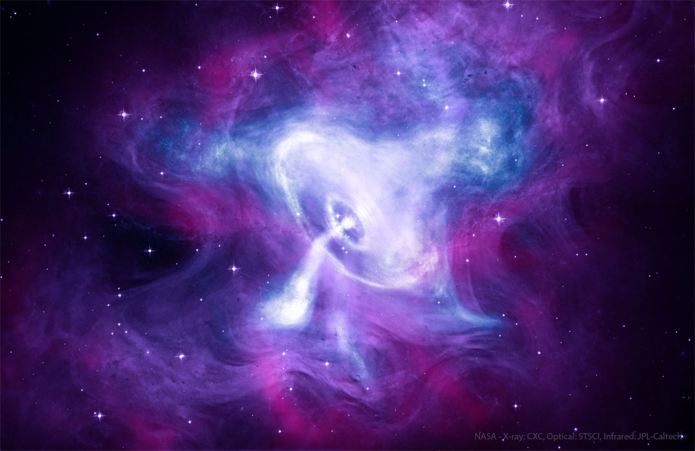

# PULSAR

Every rustacean needs a shell!

Your shell scripts deserve a type system.

<!-- https://claude.ai/code/artifact/ec7e5188-d07a-404a-bf2d-dccb3b41299d?via=auto_preview -->

The Spinning Pulsar of the Crab Nebula (*source: https://apod.nasa.gov/apod/ap220821.html*)
